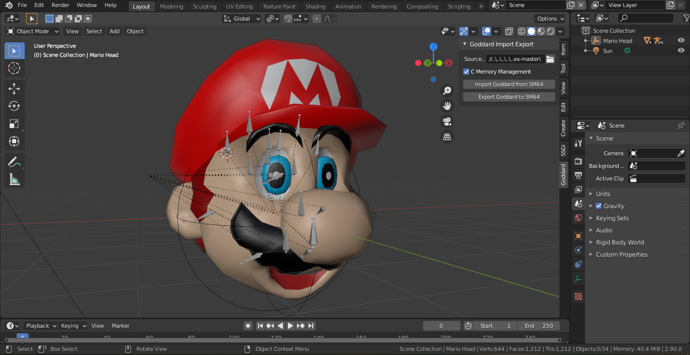
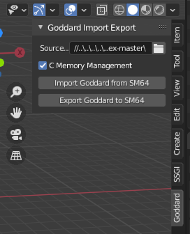

# Goddard-ImportExport-Project

Hello! This is a plugin that will help you edit Mario's Head in the title screen of Super Mario 64.
This plugin is to be used with the sm64 decomp project, or any deriviation of it.

## Installation

To get it up and running, just take the `goddard_addon` folder in this repo, and compress to a zip. Open blender if you haven't already, and install it like any other addon. You're all set to use it. :)

## Usage

As you can see, you'll find the controls here in the 3D viewport. It's quite simple really.

- First you must define where the source code for SM64 is. You must select its root.
- Then import the head the source already has (You must at least select something in the scene first though.)
- Edit the imported head to your heart's content. Be sure that it still has all of its weights. They're really important.
- Once you're done, select the head root (The sphere empty) and just export to the project. The addon should generate a `goddard` folder at the root of the source code. Move it into the `src` folder, and the process is complete.

One more thing. If you plan on creating a high poly head, you should probably enable `C Memory Management` to have the compiled game run successfully.

## Limitations and Issues

This addon is pretty powerful, but it has its limits.

- No textured material; only simple colours.
- Inability to edit the skeleton that's imported. It's only there for reference.
- Can't move the eyes. You must edit the head with the eyes in mind.
- There seems to be an issue with exporting meshes with the poly count lower than the original.
- You can't, and shouldn't delete whole meshes. A quick fix to that would probably be to either move it out of the way, or scale it _really_ small.

If you come across any issues, please open one [here](https://github.com/SIsilicon/Goddard-ImportExport-Project/issues). First check to see if anyone else reported a similar issue though please. :)
